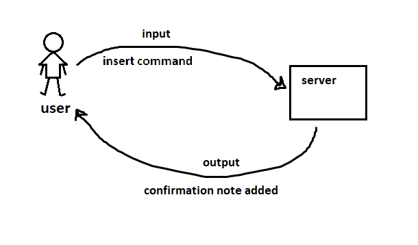

# LAB - Class 01

## Lab: Node Ecosystem

### Author: Darah

### Links and Resources

- [submission PR](https://github.com/Darah98/notes/pull/1)

### Setup
#### How to initialize/run your application (where applicable)

- to run application: `npm start`

#### How to use your library (where applicable)

- to add new note: `node index.js -a 'note you need to add'`

#### UML

<!-- -------------------------------------------------------- -->

# LAB - Class 02

## Lab: Functional Programming

### Author: Darah

### Links and Resources

- [submission PR](https://github.com/Darah98/notes/pull/2)
- [ci/cd](GitHub Actions)

### Setup
#### How to initialize/run your application (where applicable)

- to run application: `npm start`

#### How to use your library (where applicable)

- to add new note: `node index.js -a 'note you need to add'`

#### UML

