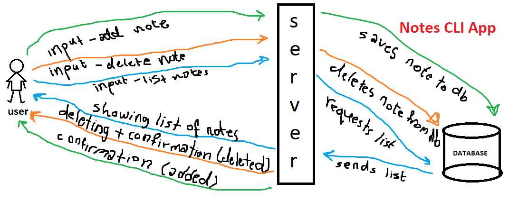

# LAB - Class 04

## Lab: Advanced Mongo/Mongoose

### Author: Darah

### Links and Resources

- [submission PR](https://github.com/Darah98/notes/pull/4)
- [ci/cd](https://github.com/Darah98/notes/runs/717194559?check_suite_focus=true)

### Setup
#### How to initialize/run your application 

- to run application: `npm start`
- to add new note: `node index.js --add 'note you need to add' || --category 'category name'`
- to delete an existing note: `node index.js --delete 'note ID'`
- to list notes: `node index.js --list || --category 'category name'`

#### UML

